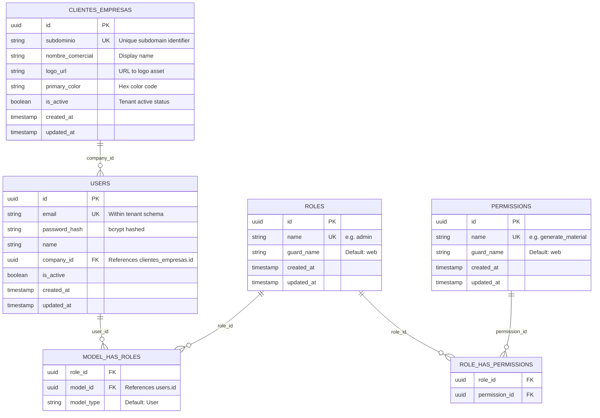

# Data Model: Fundamentos y Autenticación B2B

## Entity Relationship Diagram



## Schema Distribution

| Entidad | Schema | Razón |
|---------|--------|-------|
| `clientes_empresas` | `public` | Datos globales, consultados antes del auth para branding |
| `users` | `tenant_<company_id>` | Aislamiento físico por tenant |
| `roles` | `tenant_<company_id>` | Roles pueden variar por tenant en futuro |
| `permissions` | `tenant_<company_id>` | Permisos pueden variar por tenant en futuro |
| `model_has_roles` | `tenant_<company_id>` | Asignación usuario-rol por tenant |
| `role_has_permissions` | `tenant_<company_id>` | Asignación rol-permiso por tenant |

## Validation Rules

| Campo | Regla |
|-------|-------|
| `clientes_empresas.subdominio` | UNIQUE, lowercase, alphanumeric + hyphens, 3-30 chars |
| `clientes_empresas.primary_color` | Hex color format: `#RRGGBB` |
| `users.email` | UNIQUE within tenant schema, valid email format |
| `users.password_hash` | bcrypt hash, min 8 chars raw password |
| `roles.name` | UNIQUE within tenant schema |
| `permissions.name` | UNIQUE within tenant schema |

## V1 Seed Data (per tenant)

```sql
-- Roles
INSERT INTO roles (id, name, guard_name) VALUES
  (gen_random_uuid(), 'admin', 'web');

-- Permissions (all available in V1)
INSERT INTO permissions (id, name, guard_name) VALUES
  (gen_random_uuid(), 'view_catalogs', 'web'),
  (gen_random_uuid(), 'edit_catalogs', 'web'),
  (gen_random_uuid(), 'view_materials', 'web'),
  (gen_random_uuid(), 'generate_material', 'web'),
  (gen_random_uuid(), 'review_material', 'web'),
  (gen_random_uuid(), 'view_syllabus', 'web'),
  (gen_random_uuid(), 'edit_syllabus', 'web'),
  (gen_random_uuid(), 'manage_academic_time', 'web');

-- Assign all permissions to admin role
INSERT INTO role_has_permissions (role_id, permission_id)
  SELECT r.id, p.id FROM roles r, permissions p WHERE r.name = 'admin';
```
