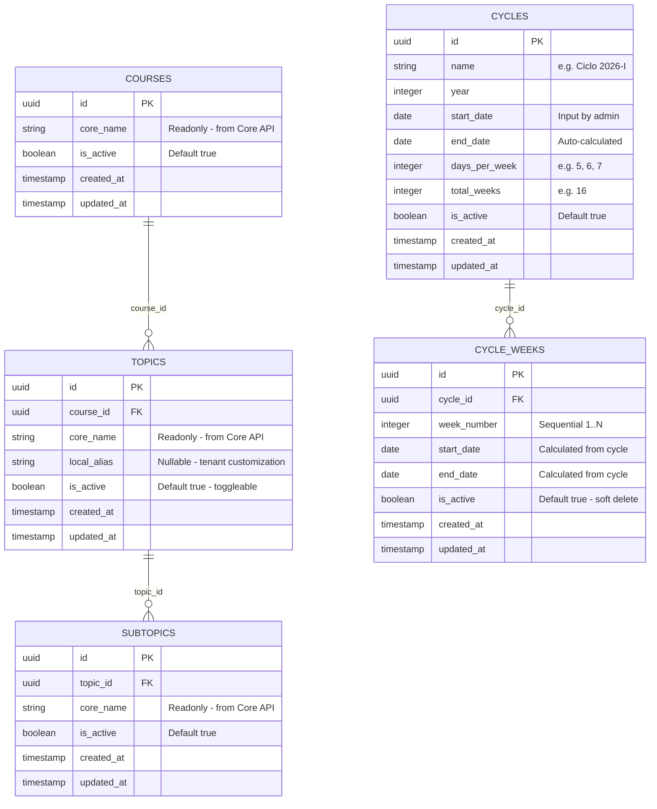

# Data Model: Catálogos y Tiempo Académico

## Entity Relationship Diagram



## Schema Distribution

Todas las entidades residen en el schema del tenant (`tenant_<company_id>`).

## Validation Rules

| Campo | Regla |
|-------|-------|
| `topics.local_alias` | Nullable, max 200 chars. Si null, UI muestra `core_name` |
| `subtopics` | No tiene `local_alias` — read-only |
| `cycles.days_per_week` | Integer 1-7 |
| `cycles.total_weeks` | Integer 1-52 |
| `cycles.start_date` | Valid date, not in the past |
| `cycles.end_date` | Auto-calculated: `start_date + (total_weeks × days_per_week) days` |
| `cycle_weeks.is_active` | Cannot DELETE row, only toggle is_active |

## Display Name Resolution (Frontend)

```
displayName = topic.local_alias ?? topic.core_name
```

For subtopics: always `subtopic.core_name` (no alias).
