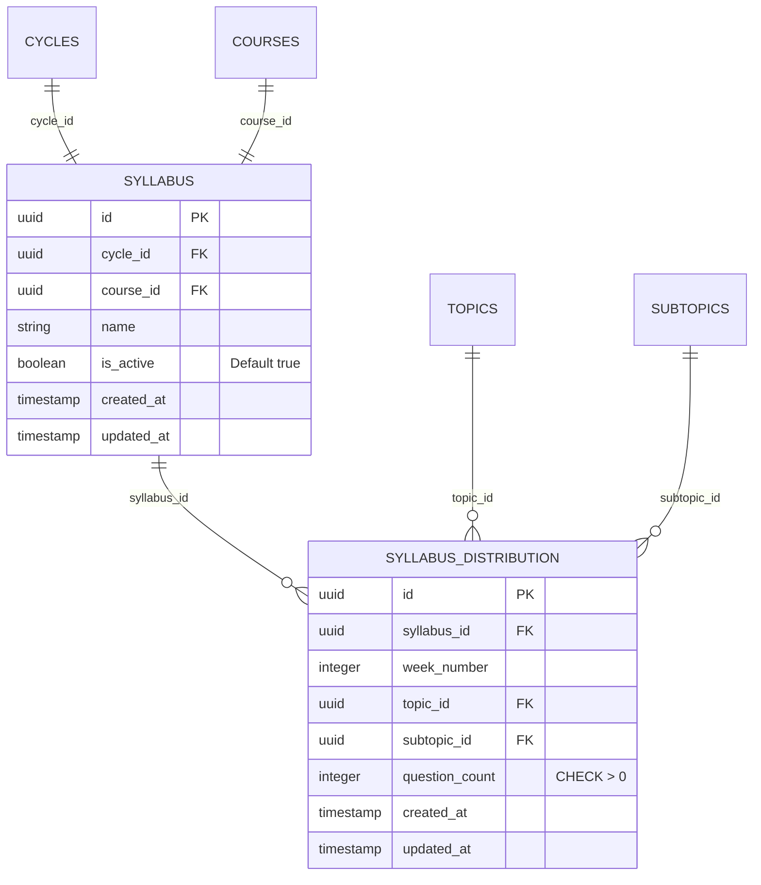

# Data Model: Gestión de Sílabos

## Constraints

- UNIQUE: (`syllabus_id`, `week_number`, `topic_id`, `subtopic_id`)
- CHECK: `question_count > 0`
- CHECK: Sum of `question_count` per `week_number` <= 100
- No CASCADE DELETE on distributions when syllabus is deactivated
