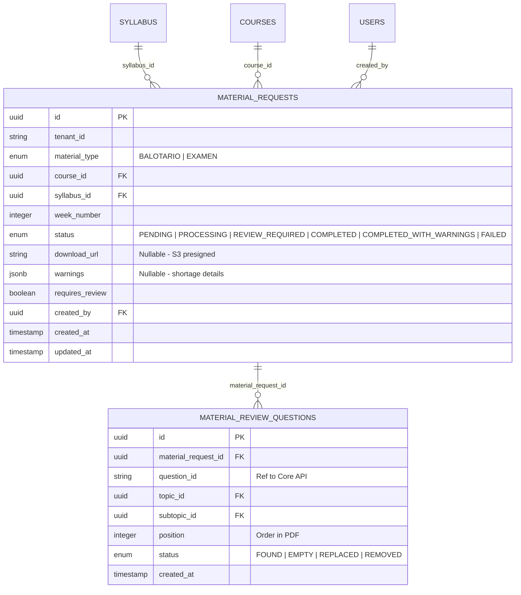

# Data Model: Generación y Revisión de Materiales

```mermaid
erDiagram
    MATERIAL_REQUESTS ||--o{ MATERIAL_REVIEW_QUESTIONS : "material_request_id"
    SYLLABUS ||--o{ MATERIAL_REQUESTS : "syllabus_id"
    COURSES ||--o{ MATERIAL_REQUESTS : "course_id"
    USERS ||--o{ MATERIAL_REQUESTS : "created_by"

    MATERIAL_REQUESTS {
        uuid id PK
        string tenant_id
        enum material_type "BALOTARIO | EXAMEN"
        uuid course_id FK
        uuid syllabus_id FK
        integer week_number
        enum status "PENDING | PROCESSING | REVIEW_REQUIRED | COMPLETED | COMPLETED_WITH_WARNINGS | FAILED"
        string download_url "Nullable - S3 presigned"
        jsonb warnings "Nullable - shortage details"
        boolean requires_review
        uuid created_by FK
        timestamp created_at
        timestamp updated_at
    }

    MATERIAL_REVIEW_QUESTIONS {
        uuid id PK
        uuid material_request_id FK
        string question_id "Ref to Core API"
        uuid topic_id FK
        uuid subtopic_id FK
        integer position "Order in PDF"
        enum status "FOUND | EMPTY | REPLACED | REMOVED"
        timestamp created_at
    }
```
