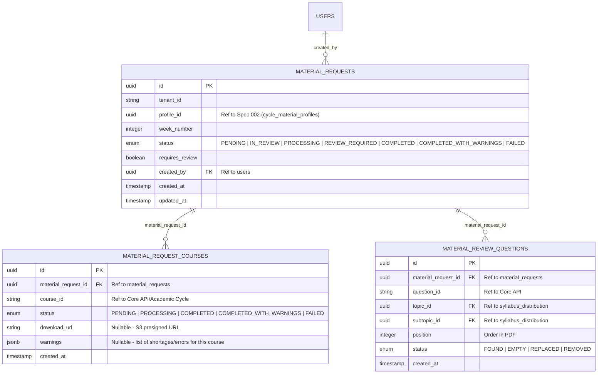

# Data Model: Generación y Revisión de Materiales

## Convenciones de Base de Datos (Database Conventions)
De acuerdo con la **Constitución de Odiseo**:
- Todos los nombres de tablas, columnas y claves primarias/foráneas están definidos exclusivamente en inglés y utilizando `snake_case`.
- Cada tenant tiene su propio esquema aislado (modelo multi-tenant Schema-per-tenant). Por ende, las tablas anteriores residen dentro de cada esquema de tenant.
- La tabla `material_requests` mantiene la trazabilidad de la solicitud general y sus estados de auditoría, mientras que `material_request_courses` maneja la granularidad física de los archivos generados y sus URLs.
