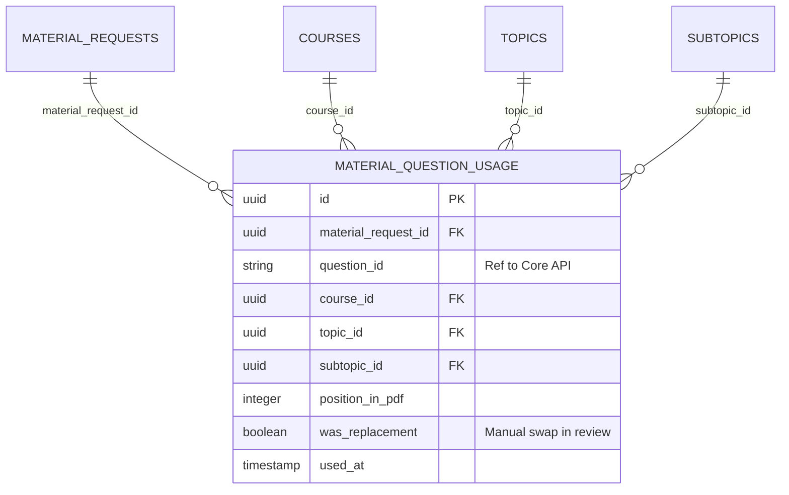

# Data Model: Historial y Trazabilidad


```mermaid
erDiagram
    MATERIAL_REQUESTS ||--o{ MATERIAL_QUESTION_USAGE : "material_request_id"
    COURSES ||--o{ MATERIAL_QUESTION_USAGE : "course_id"
    TOPICS ||--o{ MATERIAL_QUESTION_USAGE : "topic_id"
    SUBTOPICS ||--o{ MATERIAL_QUESTION_USAGE : "subtopic_id"

    MATERIAL_QUESTION_USAGE {
        uuid id PK
        uuid material_request_id FK
        string question_id "Ref to Core API"
        uuid course_id FK
        uuid topic_id FK
        uuid subtopic_id FK
        integer position_in_pdf
        boolean was_replacement "Manual swap in review"
        timestamp used_at
    }
```

## Index (Performance Critical)

```sql
CREATE INDEX idx_question_usage_exclusion
ON material_question_usage (course_id, question_id, used_at DESC);
```
